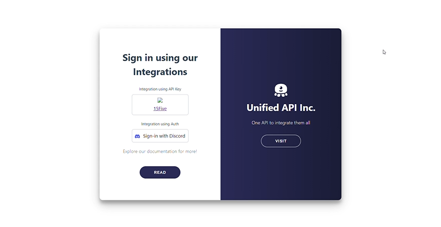

# Unified Sample App

Welcome to the **Unified Sample App**, a powerful tool designed to simplify integration with the **Unified API**. This app provides a seamless way to connect, integrate, and interact with data across multiple platforms using Unified's robust and secure API. Whether you need to fetch, sync, or process data lying within your integrations, this app ensures a hassle-free experience with minimal configuration and maximum efficiency.

By leveraging Unified API's capabilities, this app allows developers to focus on building innovative solutions without worrying about the complexities of managing multiple integrations. From fetching valuable insights to syncing critical data, this app is your gateway to unlocking the full potential of Unified's integration platform.

---

## How It Works

1. **Simple Integration**: Quickly authenticate and integrate with Unified API.
2. **Data Fetching**: Retrieve data from any connected integration in a matter of seconds.
3. **Seamless Connectivity**: Unified handles the heavy lifting, so you can focus on using the data.

---

## Demo Video

Watch the video below for a quick walkthrough of how to use the Unified Sample App:

---

Feel free to explore, extend, and enhance the app to suit your unique integration needs. Let us know your thoughts, and enjoy building with Unified API! 🚀
